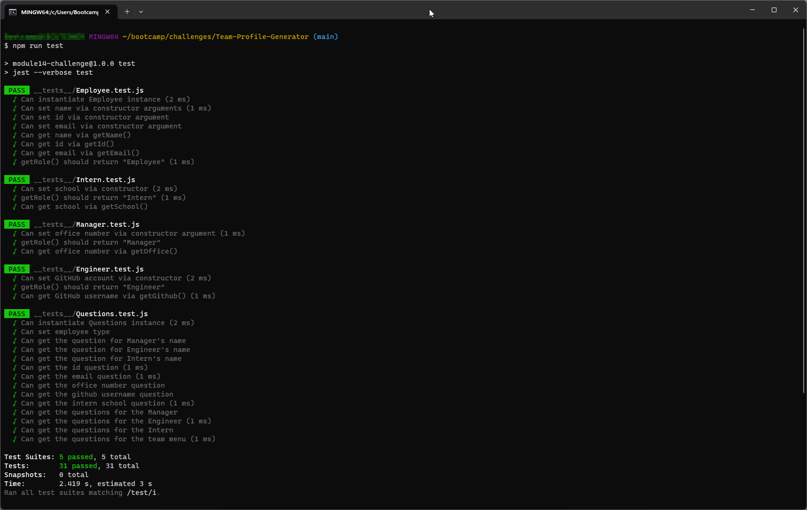
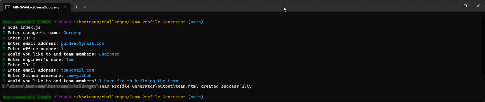
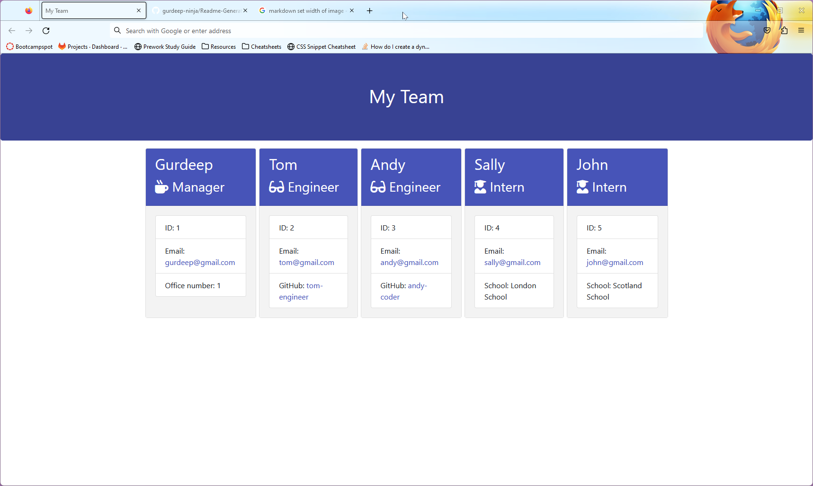

# Test-Driven Development: Team Profile Generator challenge 
## Description
A command line app that will gather data on the members of a software engineering team and use it to produce a web page in HTML format. This page will present individual summaries for each employee. The app also incorporates a number of unit tests built using JEST.
## Table of Contents
[Installation](#installation)<br>
[Usage](#usage)<br>
[License](#license)<br>
[Contributing](#contributing)<br>
[Tests](#tests)<br>
[Questions](#questions)<br>
[Screenshots](#screenshots)<br>
[Video](#video-demo)
## Installation
To use this application, you must have ```node``` & ```npm``` installed.

To install, please make a clone of this repository to your local pc or web server.

Once you have cloned the repository, run the ```npm install``` command to download the project dependencies.
## Usage
To start the application, run the command ```node index.js```

You will be prompted a series of questions for each of the employees' that you want generated in the HTML file.

The HTML file generated will be saved in the location ```./output/team.html```
## License
This app uses the following license: GNU General Public License v3.0
## Contributing
To contribute to this project simply fork this repository on GitHub and create pull requests. I will then merge your changes after a review.
## Tests
To run the JEST unit tests, run the command ```npm run test```. 

[Click here to view screenshot of test output](#screenshots).

**Note:** An additional unit test was added to develop a ```Questions``` class which the app will use for the inquirer user prompts (see ```./__tests__/Questions.test.js ``` for details).

## Questions
If you have any questions or would like to get in touch, please see my contact details below.<br>
GitHub: [gurdeep-ninja](https://github.com/gurdeep-ninja)<br>
## Screenshots
### Unit tests
<br>

### User prompts
<br>

### Generated HTML file

## Video Demo
To view the video demo of the app in action, please click on the link below. This will take you to the screencastify.com website

[Click here to view demo](https://watch.screencastify.com/v/qWlhIT2ElaQAyjiKSk32)